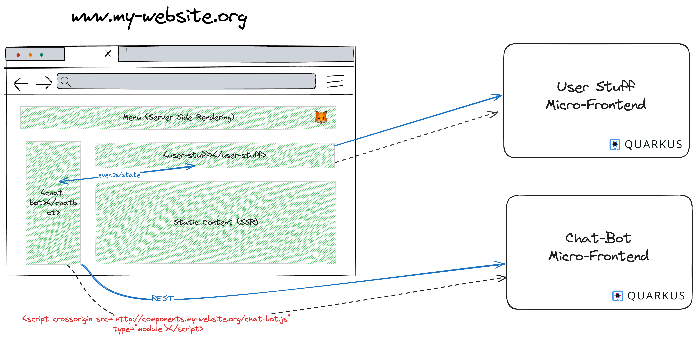

  
  
`devJoy++` avec Quarkus

<div class="fragment fade-up">

> « Une stack de fou pour le full-stack »
>`Épisode Micro-Frontend`

</div>

---
  
## Andy Damevin  
  
- [~]Principal Software engineer, Red Hat  
- [~]Quarkus team for 5 years  
- [~]Lead of the Quarkus Web team  
- [~]`@ia3andy`  
  
---
  
### What is Quarkus?  
  
- [~fade-right]Open Source Cloud-Native Java framework  
- [~fade-right]Tailored for both the JVM and native (GraalVM)  
- [~fade-right]Build time `vs` Runtime processing (extensions)  
  
---
  
### Why Quarkus?  
  
- [~fade-left]Lower memory usage and faster startups  
- [~fade-left]Easy containerization and cloud deployments  
- [~fade-left]Community and Standards
- [~fade-left]Developer Joy`++`  
  
---
  
### What can we create with Quarkus?  
  
- [~fade-left]Cloud-Native, Serverless, Micro-Services, Command-Lines…  
- [~fade-left]Monolith 👻  
- [~fade-left]And Web Applications!  
  
---

### Web Components with Lit

- [~fade-left]Create new custom, reusable, encapsulated HTML tags to use in web pages and web apps
- [~fade-left]W3C specification standards
- [~fade-left]Lit is tiny
- [~fade-left]Easy to use with Quarkus

--

```typescript

@customElement('simple-greeting')
export class SimpleGreeting extends LitElement {
  static styles = css`p { color: blue }`;

  @property()
  name = 'Somebody';

  render() {
    return html`<p>Hello, ${this.name}!</p>`;
  }
}

```

--

```html
<simple-greeting name="World"></simple-greeting>
```

--

<p style="color: blue;">Hello, World!</p>

---

#### Micro-Frontends with Quarkus

<!-- .element width="100%"  -->  

---

### Pierre Programming

<!-- .element width="50%"  -->  
  
[red.ht/pierre-programming](red.ht/pierre-programming)  


---
  
```java
System.out.println("Let's create a micro-frontend? 🚀");  
``` 
  
---
  
### Questions?

<!-- .element width="50%"  -->  

--

### Give feedback 👊

<!-- .element width="40%"  -->  

