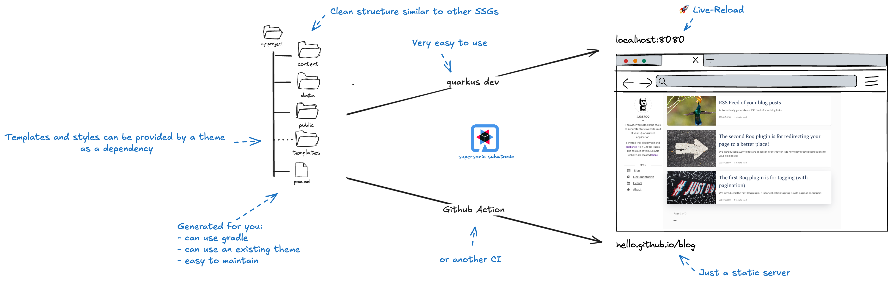
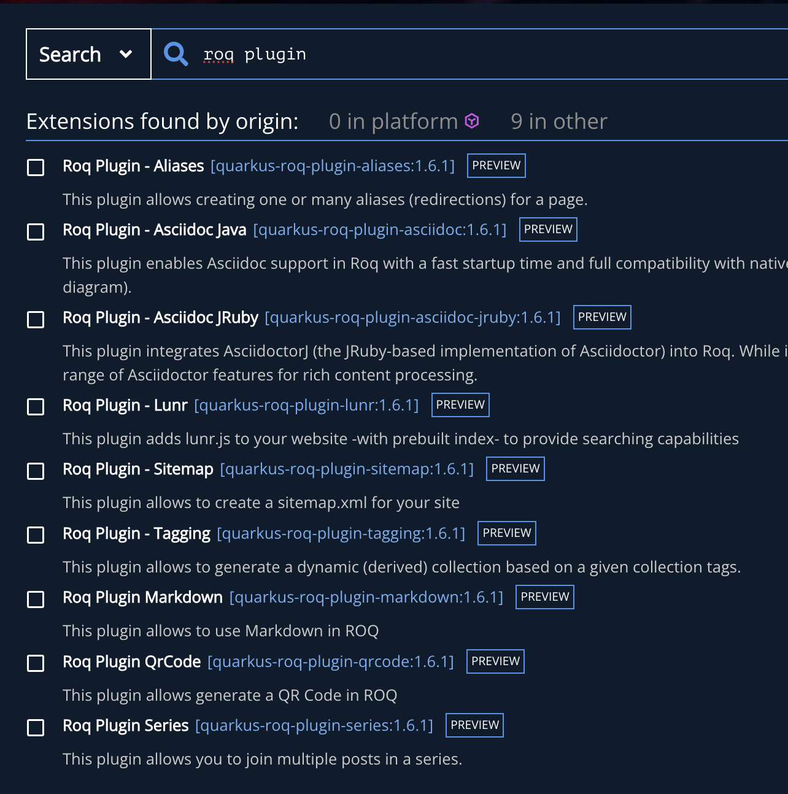
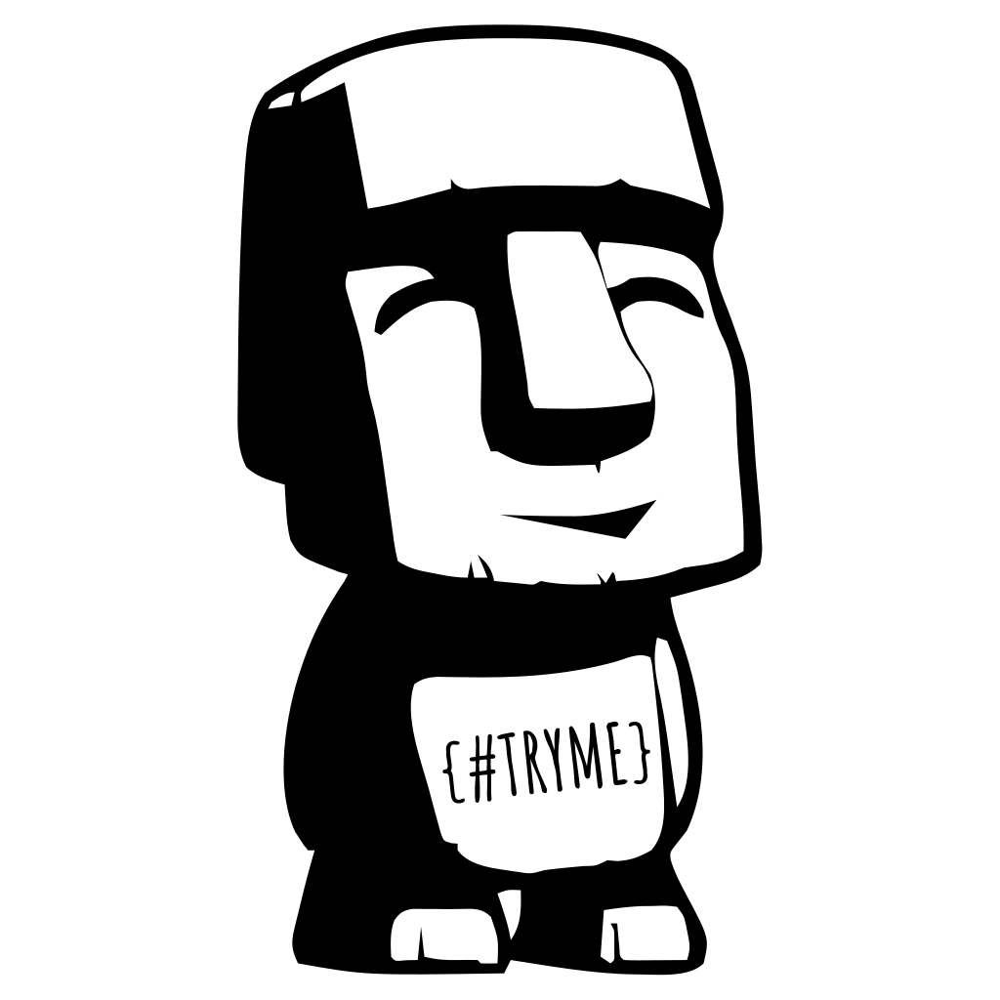

<!-- .element height="500px"  -->  

---
##  SSG?

Ideal for scenarios with high read demands and relatively infrequent writes:
- [~]**Portfolio & Blogs**
- [~]**Personal website/Resume**
- [~]**Events/Catalog repository**
- [~]**Landing & corporate**

---
##  What is Roq?

```js
SSG + Quarkus super-powers = Roq
```

Following conventions from popular SSGs

(Jekyll, Hugo, ...)

---
## Advantages of Roq

- [~]**Java skills not needed**
- [~]**Quarkus-based**
- [~]**Reproducibility Across Platforms**
- [~]**Themes & Plugins as deps**
- [~]**Easy to maintain/update**
- [~]**Speed**
- [~]**Type Safety**
- [~]**Developer Joy**

---
## Already famous 🤘

- [MarsJug](https://marsjug.org/)
- [Joel's NetObserv.io](https://netobserv.io/)
- [Roq's blog](https://iamroq.com)
- [...](https://iamroq.com/roqers/)


---




---


[Time to Roq 🗿?](https://code.quarkus.io/?g=so.spicy&a=foodporn-hub&e=io.quarkiverse.roq%3Aquarkus-roq)


---
## Themes

- [~]Made as Java libraries: 
- [~]Includes:
	- [~]layouts and  partials (overridable)
	- [~]data mapping definition
	- [~]styles and scripts (bundled)


---
## Roq Plugins

Made as Quarkus extensions:

 <!-- .element height="300px"  -->  

[~] => `Clean api for dev` & `Easy to install!`

---

## It's Quarkus

- [~]Web-Bundler (scss, mvnpm, ...)
- [~]Extensions eco-system (Hybrid mode)
- [~]Reliable

---
## Where to get started?

- [~]iamroq.com
- [~]`code.quarkus.io`

---

## Generating & Publishing

Generate the static stuff locally in `target/roq`
```shell
quarkus build -Dquarkus.roq.generator.batch
quarkus run
```

[~] Publish with GitHub Action


---
## What's next for Roq

- [~]Image processing
- [~]Web Bundler 2 (Tailwind support)
- [~]Dev-UI site backend boosted by AI

---
## Cheapskate Tip 😇

- Deploy to GitHub Pages = `Free Hosting`
- It works with **private** repository (paid account)

---
## Like it?

🚀 Start contributing

⭐️ Give Roq a star on GitHub

--

<!-- .element width="500px"  -->  
