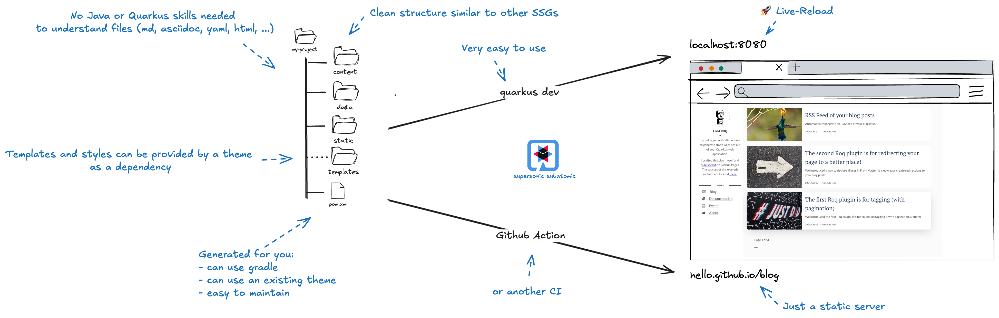

<!-- .element height="500px"  -->  

---
##  SSG?

Ideal for scenarios with high read demands and relatively infrequent writes:
- [~]**Portfolio & Blogs**
- [~]**Personal website/Resume**
- [~]**Events/Catalog repository**
- [~]**Landing & corporate**

---
##  What is Roq?

```shell
SSG + Quarkus super-powers = Roq
```

re-using conventions from popular SSGs (Jekyll, Hugo, ...).

---
## Advantages of Roq

- [~]**For everyone**
- [~]**Quarkus-based**
- [~]**Reproducibility Across Platforms**
- [~]**Themes & Plugins as deps**
- [~]**Easy to maintain/update**
- [~]**Speed**
- [~]**Type Safety**
- [~]**Developer Joy**

---



---

```shell
my-site/
├── data/                              # Roq data files
│   ├── menu.yaml                      
│   └── tags.yaml                      
├── content/                           # Content directory
│   ├── posts/                         # "posts" is the default collection
│   │   ├── 2024-10-14-roq-solid.md    # Individual post file
│   │   ├── 2024-10-20-hard-as-roq.md  
│   │
│   ├── roq-bottom.md                  # Example page file
│   └── index.md                       # The index file
├── static/                            # Configurable static directory
│   └── assets/                        
    └── post.html             
```

--

```shell
│
├── templates/                         # can be provided by a theme
│   ├── partials/                      # Qute partials to include
│   │   ├── head.html                  
│   │   └── pagination.html            
│   │
│   └── layouts/                       # Layouts for pages and documents
│       ├── base.html              
│       ├── page.html              
│   
```

---
## Themes

-  [~]Contains:
	- layouts
	- partials
	- styles and scripts (bundled)
- [~]Granular layout override
- [~]`Easy to create`
- [~]`Easy to use!`

---
## Plugins

They are Quarkus extensions:
- [~][Roq Plugin Tagging](https://docs.quarkiverse.io/quarkus-roq/dev/quarkus-roq-plugins.html#plugin-tagging)
- [~][Roq Plugin Aliases](https://docs.quarkiverse.io/quarkus-roq/dev/quarkus-roq-plugins.html#plugin-aliases)
- [~][Roq Plugin AsciiDoc](https://docs.quarkiverse.io/quarkus-roq/dev/quarkus-roq-plugins.html#plugin-asciidoc)
- [~][Roq Plugin Markdown](https://docs.quarkiverse.io/quarkus-roq/dev/quarkus-roq-plugins.html#plugin-markdown)
- [~]`Easy to create`
- [~]`Easy to use!`

---

## It's Quarkus

- [~]Web-Bundler (scss, mvnpm, ...)
- [~]Other extensions
- [~]Tests
- [~]htmx?
- [~]Hybrids

---
## Where to get started?

- [~]the doc
- [~]`code.quarkus.io`

---

## Generating & Publishing

Run the app in generator mode:
```shell
export QUARKUS_ROQ_GENERATOR_BATCH=true
mvn package quarkus:run
```

[~] `GitHub workflow example in doc`


---
## What's next

- [~]Roq's own default theme
- [~]Search
- [~]Sitemap
- [~]GitHub action
- [~]Image processing
- [~]Markup filters from Java
- [~]Dev-UI backend?

---
## Already famous 🤘

- [MarsJug](https://marsjug.org/)
- [David's blog](https://word-bits.flurg.com/)
- [Roq's blog](https://pages.quarkiverse.io/quarkus-roq/)

---
## Cheapskate Tip 😇

- Deploy to GitHub Pages = `Free Hosting`
- It works with **private** repository (paid account)

---
## Like it?

🚀 Start contributing

⭐️ Give Roq a star on GitHub

--

<!-- .element width="500px"  -->  
