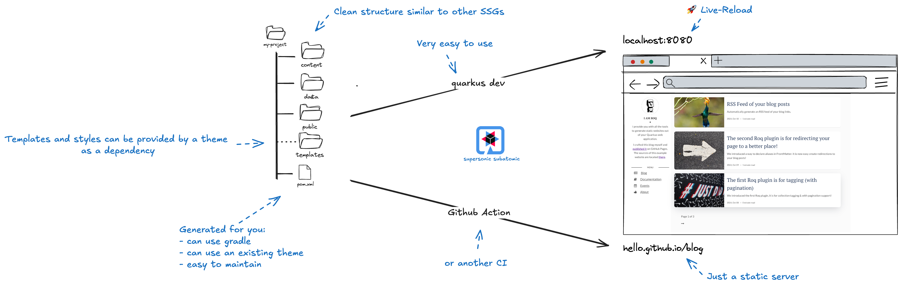
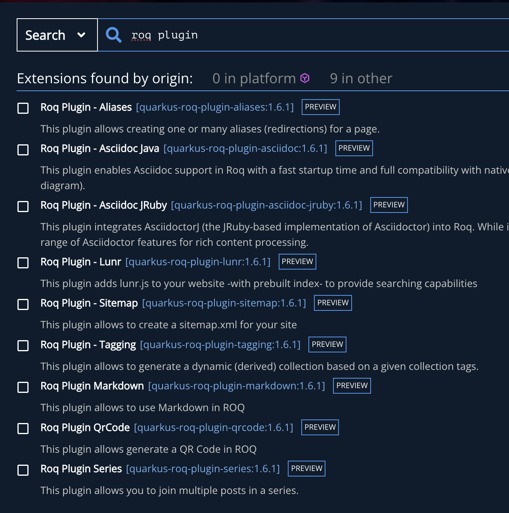
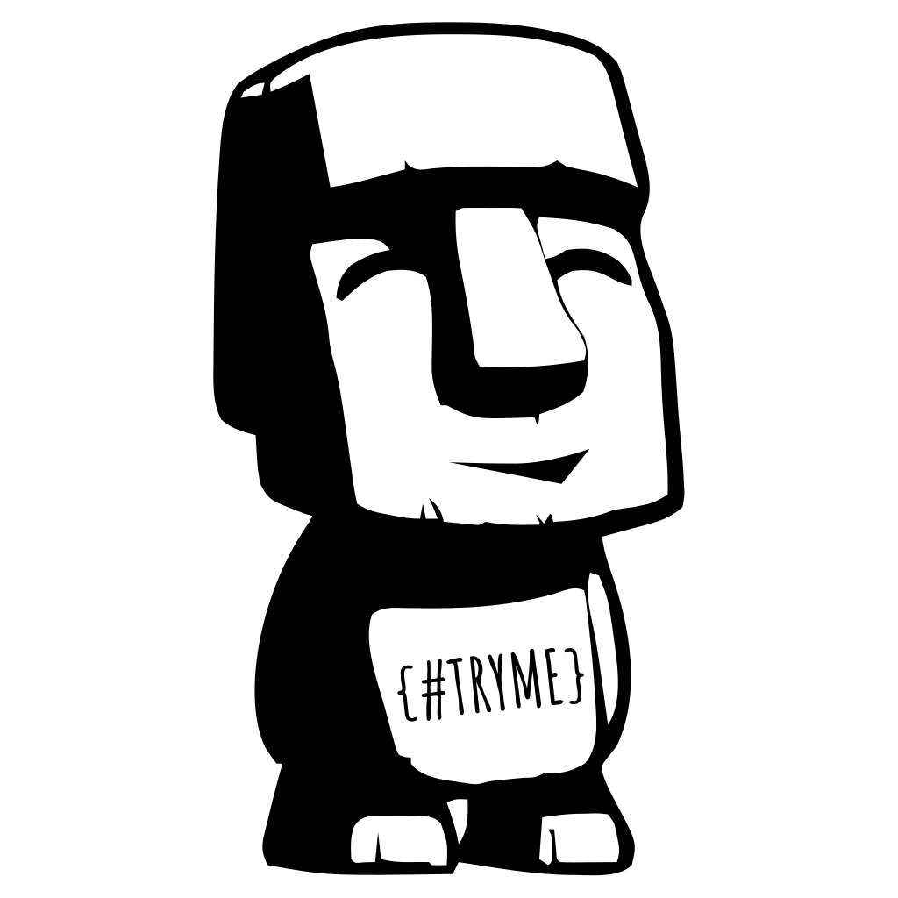

<!-- .element height="500px"  -->  

---
##  🛸 SSG? Star Gate SG1 ?

[~] => `Static Site Generator`

[~]Ideal for scenarios with high read demands and relatively infrequent writes:
- [~]**Portfolio & Blogs**
- [~]**Personal website/Resume**
- [~]**Events/Catalog repository**
- [~]**Landing & corporate**

---
## 📗 Roq The Story

 - [~]My wife's blog (Food & Nutrition)
 - [~]Can't use Quarkus 🥺
 - [~]Jekyll 🥴
 - [~]⏰

[~] ==> `Quarkus Roq Generator`

---
## 🥷 What is Roq?

```java[1|2|3|4|5-6]
var roq = Sharingan.of("Jekyll", "Hugo", "*")
	.pumpStructure(Structure::isReasonable)
	.pumpFeatures(Feature::isCool)
	.tranformTo(QUARKUS);
	
println(roq);


```

<div class="fragment">

```java
==> Just another SSG but with a very cool dev-exp
```

</div>


---
## ✌️ Easy Peasy 




---

## 🦟 🤺 Debugging session

---
## Advantages of Roq

[~]`My wife can use it !`

[~]— She is not a **developer**.

[~]


--

- No java skills needed
- [~]Reproducibility Across Platforms
- [~]Themes & Plugins as simple deps
- [~]Markdown & Asciidoc support
- [~]Easy to maintain/update
- [~]Speed
- [~]Type Safety (Qute)
- [~]Testing
 
[~]**==> `Joy 😇`**


---


[Time to Roq 🗿 our own site?](https://code.quarkus.io/?g=so.spicy&a=foodporn-hub&e=io.quarkiverse.roq%3Aquarkus-roq)


---
###  Roq Themes

Themes in Roq can be more than just stylesheets —
<div class="fragment">

 Full site blueprints with:
 
 - **style & script**
 -  **logic**
 - **templates**
 - **data mapping**
 - **i18n messages**.

</div>


---
## Roq Plugins

Made as Quarkus extensions:

 <!-- .element height="300px"  -->  

[~] => `Clean api for dev` & `Easy to install!`


---

## Generating & Publishing

Generate the static stuff locally in `target/roq`
```shell
quarkus build -Dquarkus.roq.generator.batch; quarkus run;
```

[~] Publish with GitHub Action

---
### 🍔 Static vs  🏃 Dynamic?

- Full-Stack components (comments, ...)
-  [~]Hybrid approach — wip
  

---

#  1.0  

### `🎸 Oct 30, 2024`

--
## 🎬  PROD-READY 


- [~]Many JUGS ⬅️ The [RivieraJug](https://rivierajug.org/)
- [~][Roq's site by inception](https://iamroq.com)
- [~][WildFly](https://www.wildfly.org/)


 [~][... Roqers Hall of Fame 🤘](https://iamroq.com/roqers/)


---
## Moving Roq to the next level

- [~]Broken link test plugin
- [~]Hybrid approach
- [~]Image processing
- [~]Web Bundler 2 (Tailwind support)
- [~]Dev-UI CMS boosted by AI

---
## NoWhat?

🎸 Be the next in The Roqers Hall of Fame

🚀 Start contributing 

⭐️ Give a Roq star on GitHub

---


<!-- .element width="500px"  -->  
→ **[iamroq.com](iamroq.com)**


---

#### 🧐 Feedback 
<!-- .element width="500px"  -->  
