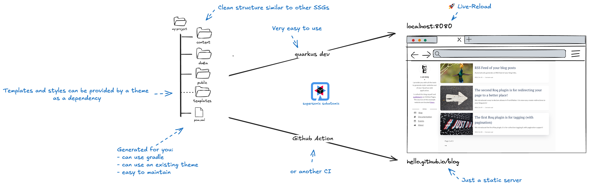
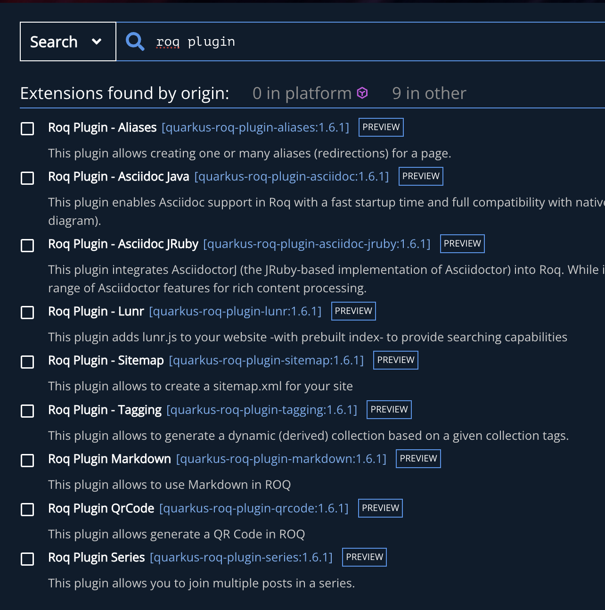

<!-- .element height="500px"  -->  

---
##  🛸 SSG? Star Gate SG1 ?

[~] => `Static Site Generator`

[~]Ideal for scenarios with high read demands and relatively infrequent writes:
- [~]**Portfolio & Blogs**
- [~]**Personal website/Resume**
- [~]**Events/Catalog repository**
- [~]**Landing & corporate**

---
## 🥷 What is Roq?

```js
SHARINGAN on Jekyll, Hugo, ... structure and features
+ Quarkus super-powers 
+ `Some unexpected cool stuff`
= Roq
```

---
## 🤺 Tchic tchic tchic 




---

✌️

https://ia3andy.github.io/resume/

---
## Advantages of Roq

`My wife can use it !`

<div class="fragment">
— and she’s not a developer.


</div>

--

- **No java skills needed**
- [~]**Quarkus-based**
- [~]**Reproducibility Across Platforms**
- [~]**Themes & Plugins as deps**
- [~]**Easy to maintain/update**
- [~]**Speed**
- [~]**Type Safety**
- [~]**Developer Joy**


---


[Time to Roq 🗿?](https://code.quarkus.io/?g=so.spicy&a=foodporn-hub&e=io.quarkiverse.roq%3Aquarkus-roq)


---
###  Roq Themes: Not Just a Pretty Face

> Themes in Roq aren’t just stylesheets —
> 
> they’re full site blueprints with **logic**, **templates**, **data mapping**, and **i18n messages**.


---
## Roq Plugins

Made as Quarkus extensions:

 <!-- .element height="300px"  -->  

[~] => `Clean api for dev` & `Easy to install!`


---

## Generating & Publishing

Generate the static stuff locally in `target/roq`
```shell
quarkus build -Dquarkus.roq.generator.batch; quarkus run;
```

[~] Publish with GitHub Action

---
## Roqqing 🎸

IN PROD 🎬

- [~]Many JUGS ⬅️ The [RivieraJug](https://rivierajug.org/)
- [~][Roq's site by inception](https://iamroq.com)
- [~][WildFly](https://www.wildfly.org/)
- [~][Roqers Hall of Fame 🤘](https://iamroq.com/roqers/)


---
## Moving Roq to the next level

- [~]Quarkus Wrapper
- [~]Image processing
- [~]Web Bundler 2 (Tailwind support)
- [~]Dev-UI site backend boosted by AI

---
## ~Backend~ Heroes 🦸

```java
"""
We’re used to being backend heroes, but Roq says:
'Hey Java dev… you can have a beautiful blog too.'
One that builds in a blink, is typed, themed, and deploys free to GitHub Pages.
Let’s stop hiding.

Let’s Roq.
"""
```

--

## NoWhat?

🎸 Be the next in The Roqers Hall of Fame

🚀 Start contributing 

⭐️ Give a Roq star on GitHub


--


<!-- .element width="500px"  -->  
→ **[iamroq.com](iamroq.com)**