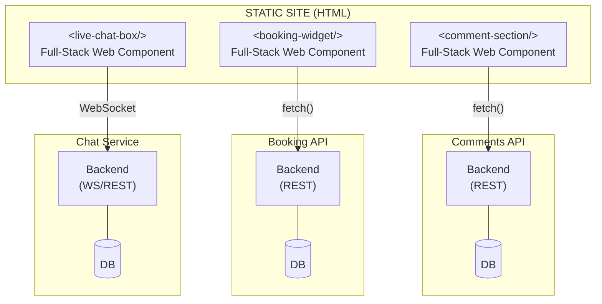
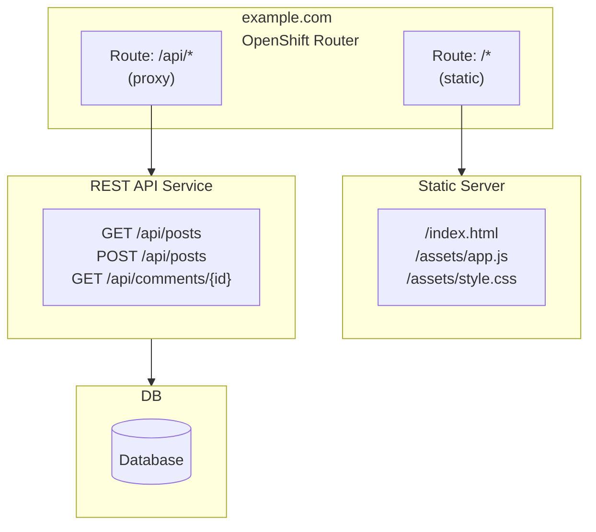

<div style="text-align: center;"><h1 class="no-title-bg" style="font-family: 'Exo 2', sans-serif; font-weight: 800; font-size: 4rem; margin-bottom: 0 !important; color: #ffffff;">Un site qui marche tout le temps</h1></div>

<div class="flex items-center justify-center gap-8 mt-8">

</div>

<div class="text-center mt-8 text-xl">Andy Damevin · Frédéric Blanc</div>

<!--
Welcome! Happy to be here

Very mystical venue

[PAUSE] OK let's go.

~1 min
-->


---
layout: two-cols
layoutClass: two-columns-split
---

# Andy Damevin

**Principal Software Engineer @ IBM**

- Love Java (and Web UI)
- Quarkus team since the early days
- Creator of **code.quarkus.io**, **mvnpm**, **Quinoa**, **Web Bundler** ...and **Roq**


::right::

# Frédéric Blanc

**Software Architect @ Praxedo**

- Love Java since 20 years
- Typical backend dev : CSS allergic ;p
- Marsjug team member, Open source contributor

<!--
Andy + Fred intro.

~2 min
-->

---


# Petit sondage 👋


~[high-2 mt-7]> ## 🙋 Allez, on lève la main !

~[high-2 mt-7]> ## 🤔 Site statique, ça vous parle ?

~[high-2 mt-7]> ## 🚀 Déjà **fait** un ?

~[high-2 mt-7]> ## 😅 Aimé le `générateur` ? Vraiment ?

<!--
Raise hands! [everyone]

Static site = ? [most hands]

Made one? [fewer]

Loved the generator? [silence]

...that silence. That's the talk.

~3 min
-->

---
clicks: 2
class: no-code-bg
---

# SSG? Supersonic Star... Gate 🪐?

<v-switch>
<template #1>

```
┌────────────────────────────────────────────────────────┐
│                                                        │
│                       Browser                          │
│                                                        │
└────────────────┬───────────────────────▲───────────────┘
                 │                       │
                 │  /page                │  HTML
                 │                       │
┌────────────────▼───────────────────────┴───────────────┐
│                                                        │
│                       Server                           │
│                 (render per request)                   │
│                                                        │
└────────────────────────────┬───────────────────────────┘
                             │
                           queries
                             │
┌────────────────────────────▼───────────────────────────┐
│                                                        │
│                      Database                          │
│                                                        │
└────────────────────────────────────────────────────────┘
```

</template>
<template #2>

```
┌─────────────────────┐                    ┌─────────────────────┐
│                     │                    │                     │
│     SSG Build       │                    │       Browser       │
│ scheduled/on-change │                    │                     │
│                     │                    │                     │
└──────────┬──────────┘                    └────┬────────────▲───┘
           │                                    │            │
           │ generate                           │ /page      │ HTML
           │                                    │            │ (instant!)
           ▼                                    ▼            │
┌─────────┐┌─────────┐┌─────────┐         ┌──────────────────┴──┐
│  .html  ││  .html  ││  .html  │         │                     │
├─────────┤├─────────┤├─────────┤ publish │    CDN / Host       │
│  .html  ││  .html  ││  .html  │────────▶│                     │
├─────────┤├─────────┤├─────────┤         │    GitHub Pages     │
│  .html  ││  .html  ││  .html  │         │    Netlify          │
└─────────┘└─────────┘└─────────┘         │    Cloudflare       │
                                          │                     │
                                          └─────────────────────┘
```

</template>
</v-switch>


<!--
Who figured it out?

SSG = Static Site Generator. Not Star Gate.

[CLICK 1] Traditional: Browser → Server → DB → HTML. Every request.

[CLICK 2] SSG: Build ahead of time. CDN serves files. No server. No DB. No 3 AM pages.

Blogs, portfolios, docs, business sites. High read, low write.

~3 min
-->

---

# Why static is 👌

<v-click>

- ⚡ **Blazing fast**
- 💰 **Cheap**
- 🔍 **SEO-friendly**
- 🔒 **Secure**

- 📦 **Portable**
</v-click>

<v-click>

=[high-3 mt-4] ## 🤖 Needed for the future

=[text-xl mb-4] LLMs and AI search engines **love** clean, static sites

</v-click>

<!--
Fast: replicated files, closest region.

Cheap: free hosting on a dozen platforms.

SEO: clean HTML, just works.

Secure: no DB to hack. "Someone steals your HTML." Good luck.

Portable: just files. Move anywhere.

Future: AI needs static. Your human creativity + clean HTML = perfect for LLMs.

~3 min
-->


---
layout: section
background: /deck-assets/roq-climbing.jpeg
class: subtitle-text
---

<h1 class="alpha-80">I am Roq, let me introduce myself</h1>

<v-click>

### Content

- **Markdown**, AsciiDoc, HTML
- **CMS/Editor** + Git sync + AI
- **Plugins & Themes** marketplace

</v-click>


<v-click>

### Powered by Quarkus

- **Templates**: Qute (TypeSafe!)
- **Data**: YAML/JSON (TypeSafe*)
- No Config **TailwindCSS** support
- Instant **Live reload**
- **Extensions** ecosystem
- **Tests** & **MCP agent**

</v-click>


<!--
Here's what Roq brings.

Content: Markdown, AsciiDoc, HTML.

Templates: Qute. Type-safe, build-time errors.

Data: YAML/JSON, also type-safe.

Live reload. Change file, see it.

CMS editor + Git sync + AI. Writers don't need a terminal.

TailwindCSS, zero config.

MCP agent, update tool, plugins marketplace, tests.

[CLICK] It's Java. [pause]

~3 min
-->


---
layout: fact
---

# Try to guess...

~> ## What percentage of the web runs on WordPress?

~[text-2xl high-4]> **43%** of the Web!

<span v-after class="text-sm text-gray-500">source: W3Techs 2025</span>

<!--
[PAUSE]

So if static is that great... why does WordPress still power 43% of the web?

[Let it hang 2-3 seconds]

Because the tooling gap is still too wide. WordPress makes it easy. We need to do the same for static.

JNation site was down 2 days before the conf. True story.

~1 min
-->


---
layout: center
---


# Most of your projects could use static

=[high-3 mt-6] ## Even if it shows dynamic content.

---

# How?


<v-click>
=[high-3 mt-6] ## 🧩 Dynamic components
=[text-lg ml-8] A component served by its own backend, embedded in a static page

</v-click>

<v-click>
=[high-3 mt-4] ## 🔀 Split Backend
=[text-lg ml-8] Static pages using backend api

</v-click>

<v-click>
=[high-3 mt-4] ## 🔄 Hybrid
=[text-lg ml-8] Same app, same codebase: static + dynamic

</v-click>

<!--
Dynamic components & mixed routing: failure is always partial. Static pages stay up even if the dynamic part goes down.

Hybrid: simpler architecture, mitigated by redundancy and caching. Good enough for most cases.

~3 min
-->
---

# Dynamic components



---

# Dynamic components

Static site using components with their own backend.

## Strength

- static is pure static (CDN-friendly, cacheable forever).
- static and dynamic are independent (tech stack, release cycles)
- independent lifecycle (beside tag spec and events)

## Weaknesses

- Two apps to build, host, and version 
- CSP/CORS if different domain
- Integration friction: keeping theming synchronized

<!--
pros:
 static and dynamic parts are fully decoupled : a backend outage only breaks that widget
-->

---

# Split Backend



---

# Split Backend

Static part and backend possibly share the same domain using different routes.

## Strength

- Simple mental model for frontend devs.
- One codebase/build for the whole frontend, only the API is separate.

## Weaknesses

- Backend API/Frontend coupling

---

# Hybrid

Everything on one service.

## Strength

- simplicity
- efficiency : most pages are served from cache
- backend/frontend cohesion

## Weaknesses

- a crash is a full crash

---

# Rule of thumbs

## Best production choices for heavy traffic:

- dynamic components : good when team agility is needed
- split backend : closer to monolith mental model

## Good enough solution for most applications

- hybrid : cheapest, simpler

---
layout: center
class: text-center
---


---
layout: center
class: text-center
---

# Time to Roq


=[text-3xl high-4] `roq create my-site`


<!--
OK let's see this in action. I'm going to create a Roq site from scratch, right here, right now.

[DEMO STEPS]
- Run `roq create sigmund-clinic-blog`
- Run `roq create sigmund-clinic -x theme:base`
- Show the default site in browser (and index page)
- quickly show the project structure (~same as Jekyll/Hugo)
- Create the Welcome post with editor
- List posts
- Add post layout
- Style post layout with claude
- Add plugin faker via website
- Add Clinic page
- Link Clinic page
- Show Sigmund component
- Add Sigmund component and play with it


~15-20 min
-->

---

# Already in the wild

-~ 🔗 **[mvnpm.org](https://mvnpm.org)** — Maven NPM bridge
-~ 🌐 **[blog.sunix.org](https://blog.sunix.org)** — TailwindCSS + AI, very nice result
-~ 🚀 **[quarkus.io](https://quarkus.io)** — Transitioning to Roq (search is a dynamic component served by a Quarkus microservice)


<!--
Real world examples of Roq and static + dynamic mixing.

mvnpm.org: fully static.

blog.sunix.org: personal blog on Roq. TailwindCSS + AI, great result. There's a blog post about it.

quarkus.io: transitioning to Roq. The search is a full-stack microservice in Quarkus, embedded as a dynamic component in an otherwise static site.

Quarkiverse: extension ecosystem.

~2 min
-->

---

<div class="flex items-center justify-between">
<h1>devoured.fyi</h1>

</div>

~> A daily developer tech digest

<div v-click>

```
 RSS Feeds           JBang Pipeline              Roq
┌────────────┐    ┌──────────────────────┐    ┌─────────────┐
│ AI / Tech  │───>│ 1. Fetch articles    │───>│ content/    │
│ DevOps     │    │ 2. Enrich            │    │ templates/  │──> Static HTML
│ Data       │    │ 3. Summarize (AI)    │    │ data/       │    on CDN
│ Design     │    │ 4. Tag & prioritize  │    │ web/        │
└────────────┘    └──────────────────────┘    └─────────────┘
```

</div>

~[mt-4 text-green-500]> Daily. Automated. Static. AI-powered. Java.

<!--
My daily tech digest. Built with Roq.

Pipeline: scrape TLDR newsletters → enrich → AI summaries → publish static site.

Client-side personalization, read tracking, cross-device sync via Cloudflare Workers.

Tired of reading the news... automated it. AI reads for me. I read the AI. AIs all the way down.

~3 min
-->

---

# Up Next in Roq

<v-click>

- **I18n** for collections
- **Image processing** plugin (resize, optimize, WebP)
- **New themes**: Blog, Docs, Jugs...
</v-click>

<!--
Roq 2.0 already shipped: live reload, TailwindCSS zero-config, simplified structure.

What's next:

I18n for multi-language sites.

Image processing: auto resize, optimize, WebP.

Hybrid: mix static + dynamic Quarkus endpoints. Same app.

Editor AI: content suggestions, SEO hints.

~2 min
-->


---
layout: closing
background: /deck-assets/roq-bye-bye.png
---

# Questions?

<v-click>


=[text-4xl mt-0] [iamroq.dev](https://iamroq.dev)

=[mt-8 high-4] #### Keep writing human content 💪

=[mt-4] **Contributions are welcome**

</v-click>


<!--
Thank you!

Distribution gratuite d'ordonnances Roq pour la bonne santé de vos projets!

Roq: static sites that flow naturally. No fighting the tooling.

Java. Quarkus. It rocks.

Questions?

~5 min Q&A
-->
