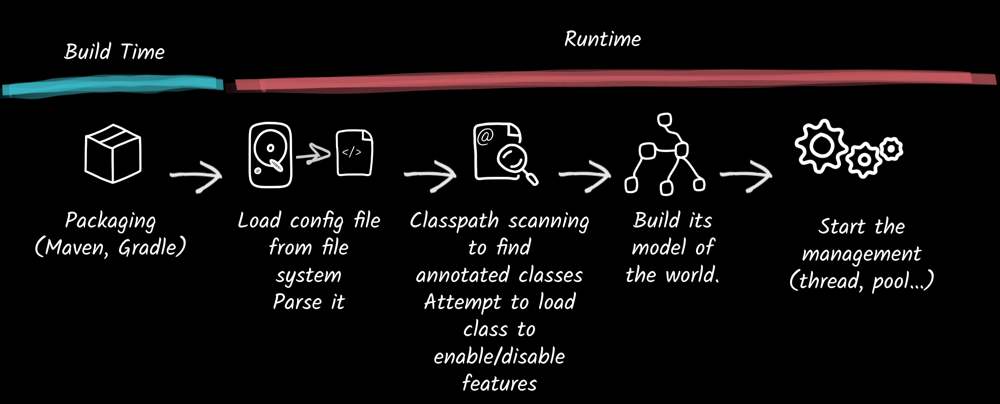
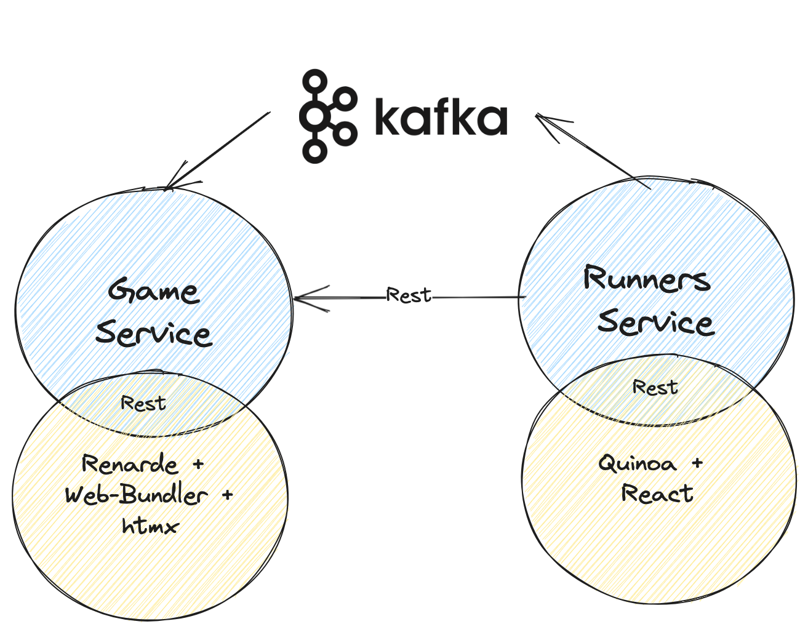

## Rotterdam

---

### Andy Damevin @ia3andy

- Red Hatter for **6 years**
- Quarkus Team for **4 years**
- Lead of the Quarkus Fullstack effort
- Hobbies: Surf, Wing Foil, Foot, Trail, Spearfishing

---
# What's Quarkus

-  An [open source project](https://quarkus.io/community/)
-  A Supersonic & Subatomic Java stack
- Tailored for OpenJDK and GraalVM
- Crafted from the best of breed libraries and standards
- Made to let you focus on your code and enjoy it

---

### How Does a Framework Start



---
### The Quarkus Way


---
### Quarkus Offers Unequaled Performance


---
## Quarkus Extensions

- &shy;<!-- .element: class="fragment" -->Make a library fit the Quarkus standards (build time processing, native mapping, config harmonization, …) 
- &shy;<!-- .element: class="fragment" -->The community is very active
- &shy;<!-- .element: class="fragment" -->There are stable extensions for almost everything
- &shy;<!-- .element: class="fragment" -->You can add your own! 

  <!-- .element height="40%" width="40%" class="fragment"  -->

---

## One Two Three Quarkus
<!-- .element height="30%" width="30%" style="background-color: white" -->

red.ht/one-two-three-quarkus


---
## Quinoa extension

Eases the development, the build and serving single page apps or web components:
- &shy;<!-- .element: class="fragment" -->Auto install NodeJS and NPM (or other package manager)
- &shy;<!-- .element: class="fragment" -->Auto detect framework
- &shy;<!-- .element: class="fragment" -->Fullstack dev-mode

---
## Web Bundler extension

- &shy;<!-- .element: class="fragment" -->Zero-configuration bundling and minification of web app scripts, dependencies and styles.
- &shy;<!-- .element: class="fragment" -->No need to install NodeJs (esbuild-java).
- &shy;<!-- .element: class="fragment" -->All the NPM catalog is accessible through Maven or Gradle dependencies (mvnpm or WebJars).

---
## Qute extension

TypeSafe templating engine with an awesome developer experience (Quarkus Tools Plugin).

```html
<html>
  <p>Hello {name}! 
</html>
```


---

## Renarde extension


Quarkus server-side Web Framework:
- &shy;<!-- .element: class="fragment" -->MVC / Play like
- &shy;<!-- .element: class="fragment" -->Based on Qute, Hibernate and RESTEasy Reactive
- &shy;<!-- .element: class="fragment" -->Enhanced for htmx

--- 

## Playwright extension

Easily create effective cross-browsers e2e tests for your Quarkus web-app using Playwright.

---
## One Two Three Quarkus
<!-- .element width="70%" style="background-color: white" -->

---

```java
System.out.println("Let's code!");
```

- &shy;<!-- .element: class="fragment" -->Count of Runners
- &shy;<!-- .element: class="fragment" -->Compute/Show Rank
- &shy;<!-- .element: class="fragment" -->Send Rank to Phone App


---
<!-- .element height="30%" width="30%" style="background-color: white" -->

red.ht/one-two-three-quarkus