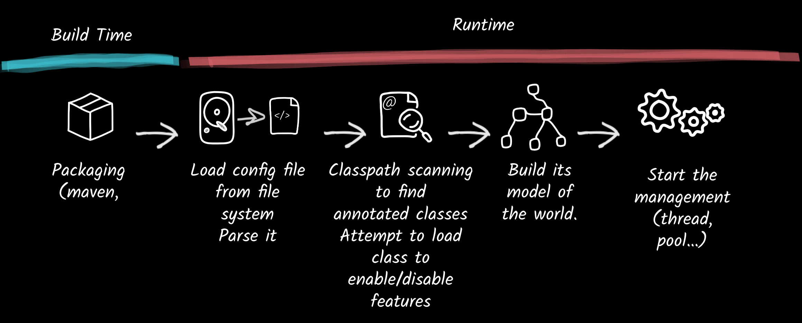
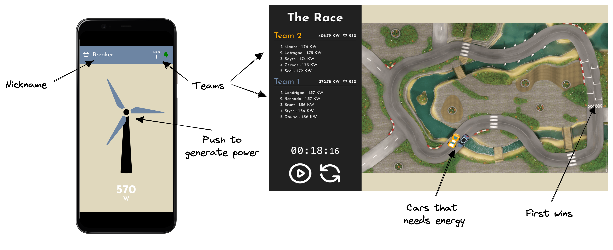

## RivieraJUG

---

### Andy Damevin @ia3andy

- Red Hatter for **5 years**
- Quarkus team for **3 years**
- Best Quarkus achievements: **code.quarkus.io, Codestarts, Quinoa & Sentry extensions**
- Hobbies: **Surf, Foot, Spearfishing, Fishing, Running**

---
# What's Quarkus

-  &shy;<!-- .element: class="fragment" -->An [open source project](https://quarkus.io/community/)
-  &shy;<!-- .element: class="fragment" -->A Supersonic & Subatomic Java stack
-  &shy;<!-- .element: class="fragment" -->Tailored for OpenJDK and GraalVM
- &shy;<!-- .element: class="fragment" -->Crafted from the best of breed libraries and standards
- &shy;<!-- .element: class="fragment" -->Made to let you focus on your code and enjoy it

---

### How Does a Framework Start


---
### The Quarkus Way


---
### Quarkus Offers Unequaled Performance


---
## Quarkus Extensions

- &shy;<!-- .element: class="fragment" -->They contain the logic to make a library fit the Quarkus standards (build time processing, native mapping, config, …) 
- &shy;<!-- .element: class="fragment" -->The community is involved [https://github.com/quarkiverse/quarkiverse/wiki](https://github.com/quarkiverse/quarkiverse/wiki)  
- &shy;<!-- .element: class="fragment" -->You can add your own! 

  <!-- .element height="40%" width="40%" class="fragment"  -->

---
## Quarkus Tooling

- Quarkus CLI
- Maven/Gradle plugins
- IDEs plugins (IntelliJ, VSCode, Eclipse, ...)
- [code.quarkus.io](https://code.quarkus.io)


---

## Quinoa Extension


---

## The Need

What are Backends made for?

&shy;<!-- .element: class="fragment" -->**Frontends** 

&shy;<!-- .element: class="fragment" -->What do we use to build modern Frontends?

&shy;<!-- .element: class="fragment" -->**React, Angular, Vue, ... (SPA)**

---

```java
System.out.println("Let's code!");
```


---

## WindTurbine Racer Demo


<!-- https://excalidraw.com/#json=tP1nvvcjKaAyDXor8_ROZ,-yS4gmVSj30zZM0hzrzG7g -->

---

## Game architecture


<!-- https://excalidraw.com/#json=luBRFxFWYqjnTP0jhKVsk,Q4BPCJV10ItswMlSio13oQ -->

---

## Let's play!
  <!-- .element height="40%" width="40%" -->

[red.ht/andy-windturbine-demo](https://red.ht/andy-windturbine-demo)

---

```java
System.out.println("Let's code!");
```

---

### Why Quarkus over NodeJS for the backend?

- Ready to use stack with all the best libraries to build efficient services <!-- .element: class="fragment" data-fragment-index="1" -->
- Smart build system <!-- .element: class="fragment" data-fragment-index="2" -->
- Developer Joy++ 🤙 <!-- .element: class="fragment" data-fragment-index="3" -->
- Test friendly <!-- .element: class="fragment" data-fragment-index="4" -->
- Easy to deploy <!-- .element: class="fragment" data-fragment-index="5" -->
- Made for the cloud <!-- .element: class="fragment" data-fragment-index="6" -->

---
## Quinoa?

- Compatible with most NodeJS built web apps <!-- .element: class="fragment" data-fragment-index="1" -->
- Live-code on the backend and frontend together <!-- .element: class="fragment" data-fragment-index="2" -->
- Integrated build/deployment with Quarkus <!-- .element: class="fragment" data-fragment-index="3" -->
- Out of the box e2e testing <!-- .element: class="fragment" data-fragment-index="4" -->
- More integrated than Maven Frontend Plugin  <!-- .element: class="fragment" data-fragment-index="5" -->
- A few others goodies <!-- .element: class="fragment" data-fragment-index="6" -->

---
## Build


---
## Runtime

Quinoa will add a Vert.x route to serve the generated web resources.

---
## 2 Live-coding Modes
 
- Same as prod, but re-building on changes.
- Auto start the NodeJS dev server and proxy requests

---

## Let's play.. AGAIN!
  <!-- .element height="40%" width="40%" -->

[red.ht/andy-windturbine-demo](https://red.ht/andy-windturbine-demo)